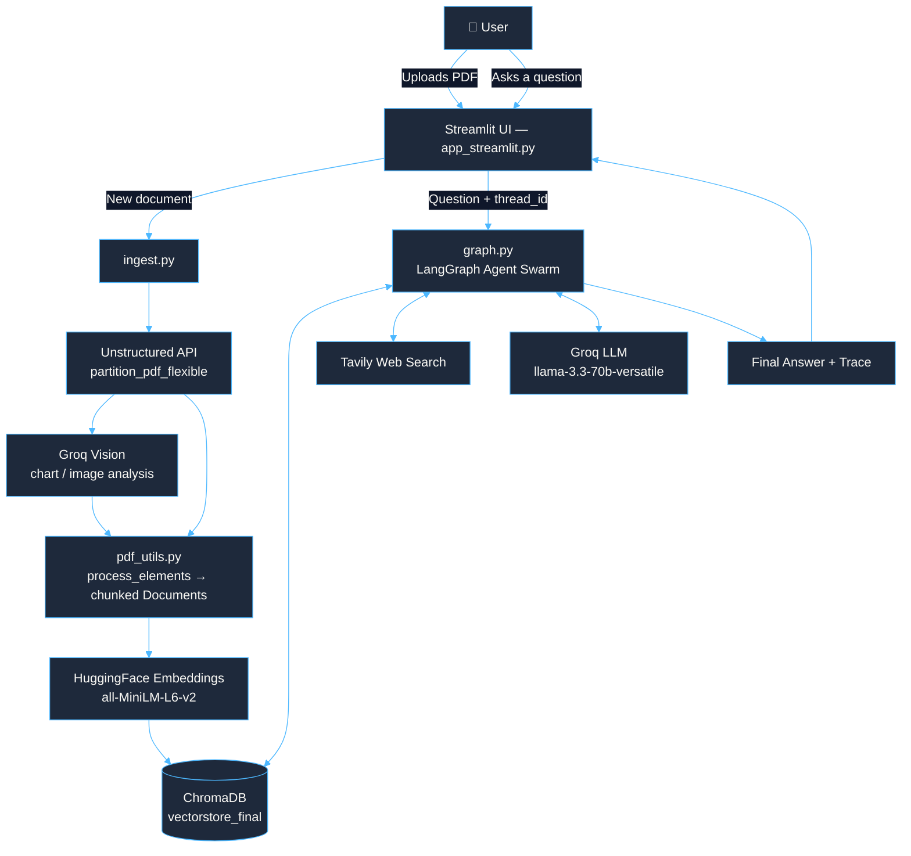
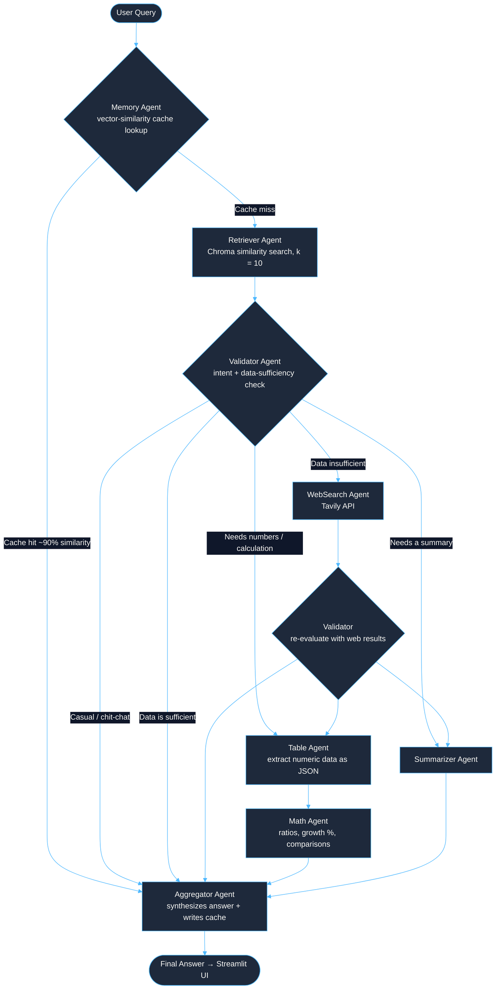
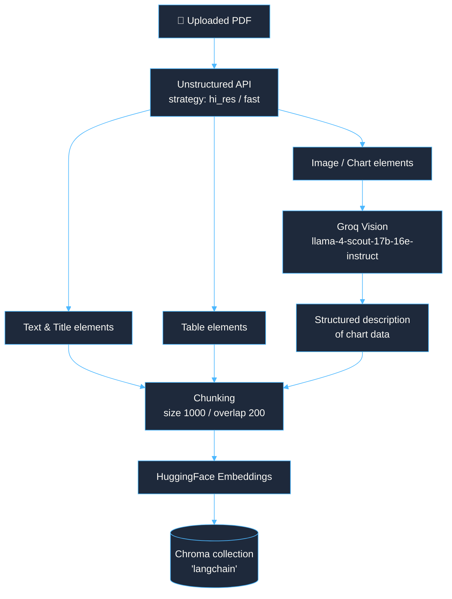
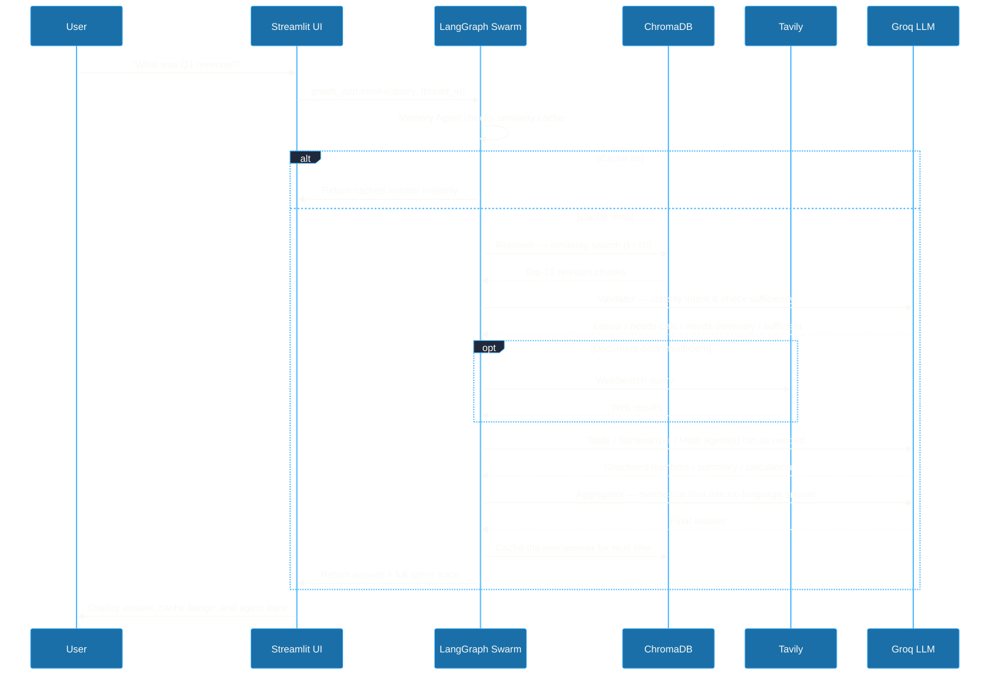
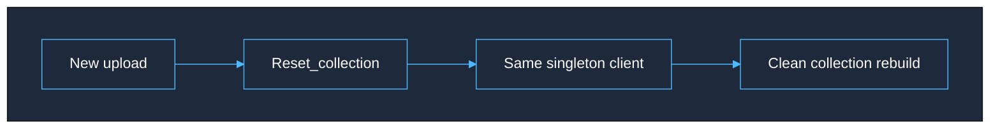

<p align="center">
  
</p>

<p align="center">
  
</p>

<p align="center">
     
</p>
<p align="center">
    
</p>

---

## 📑 Table of Contents

- [Overview](#-overview)
- [Key Features](#-key-features)
- [Architecture & Workflow Diagrams](#-architecture--workflow-diagrams)
- [Tech Stack](#-tech-stack)
- [Project Structure](#-project-structure)
- [Getting Started](#-getting-started)
- [Using the Application](#-using-the-application)
- [Agent Reference](#-agent-reference)
- [Configuration Reference](#-configuration-reference)
- [Vector Store Architecture Notes](#-vector-store-architecture-notes)
- [Troubleshooting](#-troubleshooting)
- [Roadmap](#-roadmap)
- [Contributing](#-contributing)
- [License](#-license)
- [Acknowledgments](#-acknowledgments)

---

## 🎯 Overview


> Drop in a financial document — a 10-K, an earnings report, an investor deck — and just **ask it questions** in plain English. Revenue, margins, YoY growth, risk summaries, period comparisons — it figures out what kind of answer you need and routes the query accordingly.

This isn't a single RAG chain bolted onto a chatbot. It's a **swarm of 8 specialized LangGraph agents** that hand off to one another autonomously based on what the query actually needs — a cache lookup, a vector search, a web-search fallback, table extraction, a math calculation, or a plain-language summary. There's no central "supervisor" deciding everything up front; every agent inspects the shared state and decides where to send the query next.

**Engineering highlights:**

| 🧩 Challenge | ✅ How it's solved |
|---|---|
| Multi-modal PDF parsing | Unstructured.io extracts text + tables, **Groq Vision** reads charts/graphs |
| Fast repeated queries | Vector-similarity **answer cache** — no full pipeline re-run for similar questions |
| Safe autonomous routing | 12-hop safety cutoff stops runaway agent loops |
| Stable vector store | One **singleton ChromaDB client** per process — no more tenant/locking errors on re-upload |

---

## ✨ Key Features


<table>
<tr>
<td width="50%" valign="top">

### 🐝 Multi-Agent Swarm
8 specialized agents hand off to each other dynamically instead of following one fixed pipeline.

### 📚 Retrieval-Augmented Generation
ChromaDB vector store + HuggingFace embeddings for fast semantic document search.

### 👁️ Vision-Aware PDF Parsing
Unstructured.io extracts text/tables/images; Groq Vision actually *reads* charts and graphs.

### 🌐 Web Search Fallback
Tavily kicks in automatically when the uploaded document doesn't have enough information.

</td>
<td width="50%" valign="top">

### 🔢 Financial Math Agent
Computes ratios, growth rates, comparisons, and aggregations from extracted numbers.

### ⚡ Similarity-Based Caching
Repeated or similar questions are answered instantly from a cached-answer vector store.

### 🧵 Thread-Aware Memory
Every conversation has its own thread ID and persisted history.

### 🔍 Agent Execution Trace
The UI shows exactly which agents ran, in what order, and why.

</td>
</tr>
</table>

---

## 🏗 Architecture & Workflow Diagrams


### 1. High-Level System Architecture



### 2. Agent Swarm Routing — the heart of `graph.py`

Every agent can hand off to almost any other agent — this is what makes it a *swarm* rather than a fixed pipeline. A hop-count safety limit (12 hops) forces a hard route to the Aggregator if the graph ever starts looping.


> 🛟 **Safety net:** any agent that exceeds **12 hops** is force-routed straight to the Aggregator, so the swarm can never loop forever.

### 3. Document Ingestion Pipeline



### 4. A Single Query, Step by Step



---

## 🛠 Tech Stack


<p align="left">
  
  
  
  
  <br/>
  
  
  
  
  
</p>

| Layer | Technology |
|---|---|
| Orchestration | **LangGraph** (StateGraph + MemorySaver checkpointing) |
| LLM Abstraction | **LangChain** |
| LLM Inference | **GROQ** — `llama-3.3-70b-versatile` (text), `meta-llama/llama-4-scout-17b-16e-instruct` (vision) |
| Vector Database | **ChromaDB** (`PersistentClient`, on-disk) |
| Embeddings | **HuggingFace** `all-MiniLM-L6-v2` |
| Web Search | **Tavily API** |
| PDF Parsing | **Unstructured.io** (`hi_res` / `fast`) |
| UI | **Streamlit** |
| Data Handling | **Pandas** |
| Config | **python-dotenv** |

---

## 📁 Project Structure


```
Financial--QA/
│
├── agents/
│   ├── memory_agent.py        # Cache lookup + conversation history
│   ├── retriever_agent.py     # Chroma vector search
│   ├── validator_agent.py     # Intent classification & routing logic
│   ├── websearch_agent.py     # Tavily web search fallback
│   ├── summarizer_agent.py    # Content summarization
│   ├── table_agent.py         # Structured numeric data extraction
│   ├── math_agent.py          # Financial calculations
│   └── aggregator_agent.py    # Final answer synthesis + caching
│
├── app_streamlit.py           # Streamlit chat UI, upload flow, sidebar
├── graph.py                   # LangGraph StateGraph build + routing + hop-limit safety
├── ingest.py                  # PDF → chunks → embeddings → ChromaDB pipeline
├── chroma_client.py           # Shared/singleton ChromaDB client
├── pdf_utils.py                # Unstructured partitioning + element processing + Groq Vision
├── models.py                  # Pydantic / TypedDict state models
├── decorators.py               # Retry logic, error-handling decorators
├── config.py                  # Env vars, model names, paths
├── utils.py                    # Misc helper functions
├── requirements.txt
├── .gitignore
└── README.md
```

---

## 🚀 Getting Started


### 1️⃣ Prerequisites
- Python **3.9+**
- `pip`
- Free accounts with **GROQ**, **Tavily**, and **Unstructured.io**

### 2️⃣ Clone the Repository
```bash
git clone https://github.com/Invicta0305/Financial--QA.git
cd Financial--QA
```

### 3️⃣ Create a Virtual Environment
```bash
python -m venv finance_env

# Activate (Mac/Linux)
source finance_env/bin/activate

# Activate (Windows)
finance_env\Scripts\activate
```

### 4️⃣ Install Dependencies
```bash
pip install -r requirements.txt
```

### 5️⃣ Get Your API Keys *(all required)*

<table>
<tr><td width="33%" valign="top">

#### 🟠 GROQ
*(LLM + vision inference)*

1. Go to [console.groq.com](https://console.groq.com)
2. Sign up / log in
3. Open **API Keys**
4. Click **Create API Key**
5. Copy it immediately — shown once

</td><td width="33%" valign="top">

#### 🔵 Tavily
*(web search fallback)*

1. Go to [app.tavily.com](https://app.tavily.com)
2. Sign up for free
3. Key shown right on the dashboard
4. Also under **API Keys** in settings

</td><td width="33%" valign="top">

#### 🟤 Unstructured
*(PDF parsing)*

1. Go to [unstructured.io](https://unstructured.io)
2. Sign up for API access
3. Find your key in the dashboard
4. Used for layout-aware PDF parsing

</td></tr>
</table>

> 💡 All three have free tiers that are enough for personal projects — check each provider's pricing page for current limits.

### 6️⃣ Configure Environment Variables

```bash
cp .env.example .env
```

```env
GROQ_API_KEY=your_groq_api_key_here
TAVILY_API_KEY=your_tavily_api_key_here
UNSTRUCTURED_API_KEY=your_unstructured_api_key_here
```


### 7️⃣ Run the App

**Option A — Ingest via CLI, then launch:**
```bash
mkdir -p data
# drop your PDF(s) into data/
python ingest.py
streamlit run app_streamlit.py
```

**Option B — Upload directly from the UI:**
```bash
streamlit run app_streamlit.py
```

The app opens at `http://localhost:8501` 🎉

---

## 💻 Using the Application


| Step | Action |
|---|---|
| 1️⃣ | **Upload** : sidebar → *Upload PDF Document* → choose file → *Process Document* |
| 2️⃣ | **Ask** : Type a question like "*What was the total revenue for Q1 2024?*" |
| 3️⃣ | **Inspect** : expand "*🔍 View Agent Execution Trace*" to see exactly which agents ran |
| 4️⃣ | **Manage** : start new conversations, switch threads, or clear chat from the sidebar |
| 5️⃣ | **Control caching** : bypass cache for a fresh answer, or clear it entirely |
| 6️⃣ | **Reset** : "*🔄 Reset Vector*" clears the current document so you can start fresh |

**Try asking:**
```
"What was the total revenue for Q1 2024?"
"Calculate the year-over-year profit margin."
"Compare operating expenses between Q1 and Q2."
"Summarize the key risk factors."
```

---

## 🤖 Agent Reference


| # | Agent | Responsibility | Hands off to |
|---|---|---|---|
| 1 | 🧠 **Memory** | Vector-similarity cache lookup, conversation history | Retriever (miss) / Aggregator (hit) |
| 2 | 📚 **Retriever** | Semantic search over the document's ChromaDB collection | Validator |
| 3 | 🧭 **Validator** | Classifies intent & query type; checks data sufficiency | WebSearch / Table / Summarizer / Aggregator |
| 4 | 🌐 **WebSearch** | Falls back to Tavily when document data is insufficient | Validator (re-evaluation) |
| 5 | 📝 **Summarizer** | Produces concise natural-language summaries | Aggregator |
| 6 | 🔢 **Table** | Extracts structured numeric data as JSON | Math / Aggregator |
| 7 | ➗ **Math** | Growth rates, ratios, comparisons, aggregations | Aggregator |
| 8 | 🎯 **Aggregator** | Synthesizes the final answer, writes it to cache | `END` |

---

## ⚙️ Configuration Reference


<details>
<summary><b>Click to expand config.py options</b></summary>

```python
# LLM Configuration
LLM_MODEL = "llama-3.3-70b-versatile"
EMBEDDING_MODEL = "all-MiniLM-L6-v2"

# Vector Store
DEFAULT_DB_PATH = "vectorstore_final"

# Retrieval Settings
RETRIEVAL_K = 10          # number of chunks retrieved per query

# Timeouts
AGENT_TIMEOUT = 30        # seconds, per agent call

# PDF Processing
UNSTRUCTURED_STRATEGY = "hi_res"   # or "fast" for quicker, lower-fidelity parsing
CHUNK_SIZE = 1000
CHUNK_OVERLAP = 200

# Vision API
VISION_MODEL = "meta-llama/llama-4-scout-17b-16e-instruct"
MAX_IMAGE_SIZE = 5_000_000   # 5MB
VISION_TEMPERATURE = 0
VISION_MAX_TOKENS = 2048
```

| Variable | Where it's read | Required |
|---|---|---|
| `GROQ_API_KEY` | `config.py` | ✅ Yes |
| `TAVILY_API_KEY` | `agents/websearch_agent.py` | ✅ Yes |
| `UNSTRUCTURED_API_KEY` | `config.py` | ✅ Yes |

</details>

---

## 🧩 Vector Store Architecture Notes


ChromaDB keeps its own internal, library-level cache of `System` objects, keyed by the persistence directory path — separate from anything an application builds on top of it. Earlier versions of this project deleted the on-disk vectorstore folder and created a brand-new `PersistentClient` on every ingest, which could desync chromadb's internal cache from what was actually on disk, producing:

```
ValueError: Could not connect to tenant default_tenant. Are you sure it exists?
```

**The fix:** exactly **one** `PersistentClient` is created per process and lives for the app's entire lifetime. Re-ingesting a document no longer deletes the directory or spins up a new client — it just clears and rebuilds the **collection** via `reset_collection()` in `chroma_client.py`.



---

## 🩺 Troubleshooting


<details>
<summary><b>Click to expand common issues & fixes</b></summary>

| Symptom | Likely cause | Fix |
|---|---|---|
| `GROQ_API_KEY not configured` | `.env` missing or not loaded | Confirm `.env` exists in the project root and `python-dotenv` is installed |
| `Could not connect to tenant default_tenant` | Stale/duplicate ChromaDB clients on the same directory | Use the singleton-client `chroma_client.py` / `ingest.py`; fully restart the Streamlit process, not just `st.rerun()` |
| App answers about a previously uploaded document | An old ingest didn't fully complete/replace the collection | Use **Reset Vector**, then re-upload |
| PDF processing is very slow | `UNSTRUCTURED_STRATEGY = "hi_res"` | Switch to `"fast"` in `config.py` |
| `GraphRecursionError` / agent loop never ends | Agents kept handing off in a cycle | Already capped by the 12-hop safety cutoff in `graph.py` |
| Web search results never show up | Missing/invalid `TAVILY_API_KEY` | Double-check the key and your Tavily dashboard quota |
| Vision/chart extraction returns nothing | Image > `MAX_IMAGE_SIZE` (5MB) or vision call failed | Check logs — `pdf_utils.py` falls back to text-only extraction automatically |

</details>

---

## 🗺 Roadmap


- [ ] Multi-document support (query across several uploaded PDFs at once)
- [ ] Persist conversation/cache state in a real database
- [ ] Docker Compose setup for one-command deployment
- [ ] Authentication for multi-user deployments
- [ ] Benchmark alternative embedding models

---

## 🤝 Contributing


1. Fork the repository
2. Create a feature branch: `git checkout -b feature/your-feature`
3. Commit your changes
4. Open a pull request describing what changed and why

---

## 📝 License


No license file is currently included. If you intend to share or distribute this project, consider adding a `LICENSE` file — MIT is a common, permissive choice.

---

## 🙏 Acknowledgments


- **LangChain / LangGraph** : multi-agent orchestration framework
- **GROQ** : high-performance LLM and vision inference
- **Tavily** : real-time web search API
- **Unstructured.io** : layout-aware PDF parsing
- **Streamlit** : the web UI framework powering the chat interface

<p align="center">
  
</p>

<p align="center"><sub>Made with 🧡! if this helped you, consider giving the repo a ⭐</sub></p>
